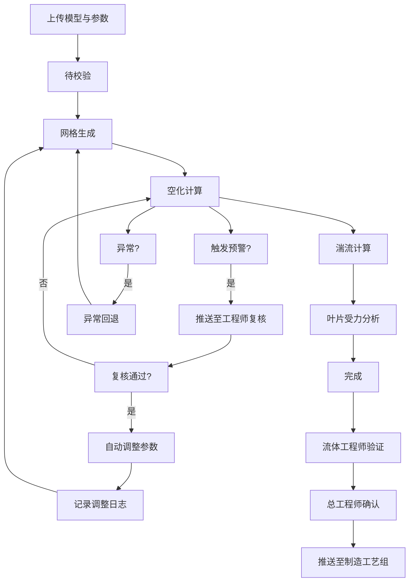
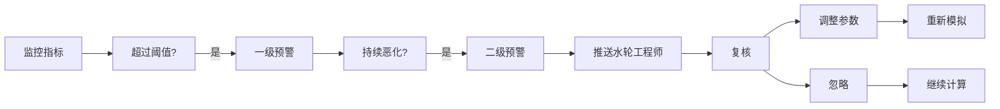

## 1. 产品概述

高精度空化流模拟与水轮机叶片抗空蚀优化平台，面向水电工程领域，提供水轮机空化流数值模拟、叶片抗空蚀优化设计及智能决策支持的专业工程仿真平台。

- 核心价值：实现水轮机空化过程的高精度数值模拟，辅助工程师优化叶片设计，降低空蚀风险，延长设备使用寿命
- 目标用户：水轮工程师、流体工程师、项目总工程师、首席科学家、叶片制造工艺组

## 2. 核心功能

### 2.1 用户角色

| 角色 | 注册方式 | 核心权限 |
|------|----------|----------|
| 水轮工程师 | 系统分配 | 上传模型、配置参数、查看模拟、复核预警、调整参数 |
| 流体工程师 | 系统分配 | 验证空化物理过程、提交审批、查看报告 |
| 项目总工程师 | 系统分配 | 审批优化方案、查看统计数据、管理项目 |
| 首席科学家 | 系统分配 | 处理异常工况、查看全局统计、制定策略 |
| 制造工艺组 | 系统分配 | 查看已审批方案、导出制造数据 |

### 2.2 功能模块

1. **综合看板**：模拟完成率、空蚀深度偏差、优化收敛次数、性能趋势图
2. **模拟任务管理**：任务列表、状态流转、任务详情、异常回退
3. **模型上传与配置**：几何模型上传、工况参数配置、网格生成设置
4. **实时监控与预警**：空泡体积分数、压力脉动、空蚀速率、多级预警推送
5. **工程师复核中心**：预警复核、参数调整、调整日志记录
6. **报告与数据导出**：综合报告PDF、空化数据导出、叶片载荷导出
7. **智能推荐引擎**：最优翼型推荐、抗空蚀涂层方案推荐
8. **两级审批流程**：流体工程师验证、总工程师确认

### 2.3 页面详情

| 页面名称 | 模块名称 | 功能描述 |
|----------|----------|----------|
| 综合看板 | 统计概览 | 展示完成率、偏差值、收敛次数等关键指标 |
| 综合看板 | 性能趋势图 | 空蚀深度、优化效果的历史趋势折线图 |
| 综合看板 | 告警概览 | 当前活跃预警、待处理审批数量 |
| 任务列表 | 任务卡片 | 展示任务状态、工况参数、进度条 |
| 任务列表 | 状态筛选 | 按状态、时间、优先级筛选任务 |
| 任务详情 | 状态时间线 | 展示任务各阶段状态流转时间 |
| 任务详情 | 监控数据 | 实时曲线、云图预览、关键指标 |
| 任务详情 | 调整日志 | 记录所有参数调整历史和原因 |
| 新建任务 | 模型上传 | 支持STEP/IGES格式几何模型上传 |
| 新建任务 | 参数配置 | 转速、水头、流量、空化模型、湍流模型 |
| 新建任务 | 网格设置 | 自适应网格、曲率识别、边界层设置 |
| 预警中心 | 预警列表 | 多级预警、触发条件、当前状态 |
| 预警中心 | 复核操作 | 复核通过/驳回、备注、调整建议 |
| 报告中心 | 报告预览 | 空泡云图、压力曲线、剪切应力热图 |
| 报告中心 | 数据导出 | 按水头/转速/导叶开度导出数据 |
| 智能推荐 | 翼型推荐 | 基于历史数据推荐最优翼型组合 |
| 智能推荐 | 涂层推荐 | 抗空蚀涂层方案推荐及寿命预测 |
| 审批中心 | 待审批列表 | 流体工程师验证、总工程师确认 |
| 审批中心 | 审批历史 | 所有审批记录及意见 |

## 3. 核心流程

### 3.1 模拟任务主流程

用户上传几何模型和工况参数后，系统自动进行网格生成、空化计算、湍流计算、叶片受力分析，过程中实时监控预警，异常时触发工程师复核，完成后生成报告并进入审批流程。

### 3.2 预警与审批流程

当空泡脱落频率导致推力波动超过5%或局部压力低于汽化压力阈值时，自动触发多级预警，水轮工程师复核后决定是否调整参数重新模拟。模拟完成后需经两级审批方可推送至制造。

## 4. 用户界面设计

### 4.1 设计风格

**整体定位：** 专业工程仿真平台，科技感与专业感并重，深色主题为主，强调数据可视化的清晰度和专业性。

- **主色调：** 深海蓝 (#0A1628) 作为背景主色，营造专业沉稳的工程氛围
- **强调色：** 科技青 (#00D4FF) 用于高亮、进度、激活状态
- **辅助色：** 警示橙 (#FF6B35) 用于预警，成功绿 (#00C853) 用于通过，危险红 (#FF1744) 用于严重异常
- **中性色：** 多级灰度，确保文字和数据的可读性
- **按钮风格：** 微立体圆角按钮，hover时有光泽效果
- **字体：** 主字体使用现代无衬线字体，数字使用等宽字体确保对齐
- **布局风格：** 左侧导航栏 + 顶部状态栏 + 主内容区的经典专业软件布局
- **数据可视化：** 使用ECharts图表，支持深色主题，曲线平滑，颜色渐变

### 4.2 页面设计概览

| 页面名称 | 模块名称 | UI元素 |
|----------|----------|--------|
| 综合看板 | 统计卡片 | 渐变背景、大数字、趋势箭头、图标 |
| 综合看板 | 趋势图表 | 面积图、双Y轴、时间筛选 |
| 任务列表 | 任务卡片 | 状态标签、进度条、关键参数摘要 |
| 任务详情 | 状态时间线 | 垂直时间线、状态节点、时间戳 |
| 任务详情 | 监控面板 | 实时曲线图、数据仪表盘、云图预览 |
| 新建任务 | 表单向导 | 步骤指示器、分组表单、参数滑块 |
| 预警中心 | 预警列表 | 级别颜色标识、触发时间、处理状态 |
| 报告中心 | 报告预览 | 分页预览、缩略图导航、缩放控制 |
| 智能推荐 | 推荐卡片 | 评分星级、对比柱状图、适用场景标签 |
| 审批中心 | 审批流程 | 流程节点图、审批意见、操作按钮 |

### 4.3 响应式

- 桌面端优先设计，针对工程仿真场景优化大屏体验
- 支持1280px及以上分辨率，最佳分辨率1920px
- 侧边栏可折叠，适配不同屏幕宽度
- 数据表格支持横向滚动，确保在较小屏幕上的可用性

### 4.4 数据可视化设计

- 空泡分布云图：使用蓝-青-黄-红渐变色阶表示体积分数
- 压力系数曲线：光滑曲线，标注关键点（最小值、汽化压力线）
- 剪切应力热图：热力图形式展示叶片表面应力分布
- 实时监控：多指标并列的实时更新折线图，支持暂停/继续
