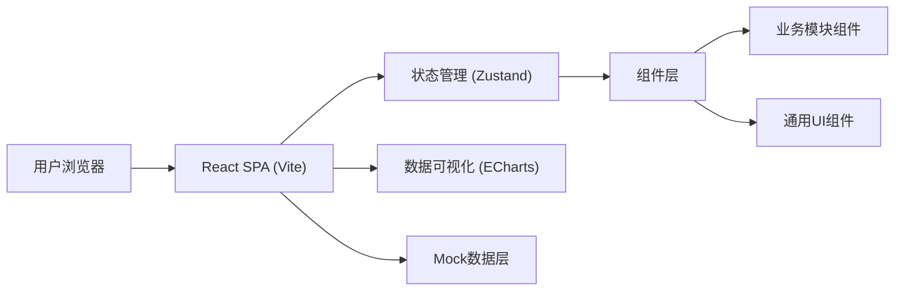
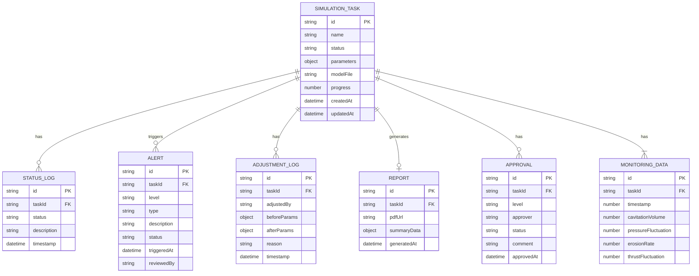

## 1. 架构设计

本平台采用前后端分离的单页应用架构，前端负责交互展示和数据可视化，后端服务以Mock数据形式嵌入前端，模拟完整业务流程。



## 2. 技术描述

- **前端框架：** React 18 + TypeScript
- **构建工具：** Vite 5
- **样式方案：** TailwindCSS 3
- **状态管理：** Zustand
- **路由管理：** React Router v6
- **数据可视化：** ECharts 5
- **图标库：** Lucide React
- **UI组件：** 基于TailwindCSS自定义构建，不依赖大型UI库

## 3. 路由定义

| 路由 | 页面 | 说明 |
|------|------|------|
| /dashboard | 综合看板 | 平台首页，展示统计数据和趋势 |
| /tasks | 模拟任务列表 | 所有模拟任务的列表展示 |
| /tasks/:id | 任务详情 | 单个任务的详细信息和监控 |
| /tasks/new | 新建任务 | 创建新的模拟任务 |
| /alerts | 预警中心 | 预警列表和复核操作 |
| /reports | 报告中心 | 报告预览和数据导出 |
| /recommendations | 智能推荐 | 翼型和涂层方案推荐 |
| /approvals | 审批中心 | 两级审批流程管理 |

## 4. 数据模型

### 4.1 核心数据实体



### 4.2 任务状态枚举

- `pending_verification` - 待校验
- `mesh_generation` - 网格生成
- `cavitation_calculation` - 空化计算
- `turbulence_calculation` - 湍流计算
- `stress_analysis` - 叶片受力分析
- `completed` - 完成
- `error` - 异常回退

### 4.3 预警级别枚举

- `level_1` - 一级预警（注意）
- `level_2` - 二级预警（警告）
- `level_3` - 三级预警（严重）

## 5. 核心模块划分

```
src/
├── components/          # 通用UI组件
│   ├── Layout/         # 布局组件
│   ├── Card/           # 卡片组件
│   ├── Chart/          # 图表组件
│   ├── StatusBadge/    # 状态标签
│   └── ProgressBar/    # 进度条
├── pages/              # 页面组件
│   ├── Dashboard/      # 综合看板
│   ├── Tasks/          # 任务管理
│   ├── Alerts/         # 预警中心
│   ├── Reports/        # 报告中心
│   ├── Recommendations/ # 智能推荐
│   └── Approvals/      # 审批中心
├── store/              # 状态管理
│   ├── taskStore.ts
│   ├── alertStore.ts
│   └── userStore.ts
├── mock/               # Mock数据
│   ├── tasks.ts
│   ├── alerts.ts
│   └── statistics.ts
├── utils/              # 工具函数
│   ├── formatters.ts
│   └── constants.ts
├── types/              # 类型定义
│   └── index.ts
├── App.tsx
├── main.tsx
└── index.css
```

## 6. 设计系统

### 6.1 颜色系统

```css
:root {
  --color-bg-primary: #0A1628;
  --color-bg-secondary: #0F1F38;
  --color-bg-tertiary: #152A48;
  --color-border: #1E3A5F;
  --color-text-primary: #E8F1FF;
  --color-text-secondary: #8AA0C0;
  --color-text-muted: #5A7090;
  --color-accent: #00D4FF;
  --color-accent-light: #4DE2FF;
  --color-warning: #FF6B35;
  --color-success: #00C853;
  --color-danger: #FF1744;
  --color-info: #448AFF;
}
```

### 6.2 字体系统

- 标题字体：现代无衬线，字重500-700
- 正文字体：清晰易读，字重400
- 数字字体：等宽字体，确保数据对齐

### 6.3 间距系统

采用8px基准网格系统：
- xs: 4px
- sm: 8px
- md: 16px
- lg: 24px
- xl: 32px
- 2xl: 48px

## 7. 动画与交互

- 页面切换：淡入淡出 + 轻微位移动画
- 数据更新：数字滚动动画
- 悬停效果：背景色变化 + 轻微上移
- 加载状态：骨架屏 + 脉冲动画
- 状态变更：平滑过渡动画
